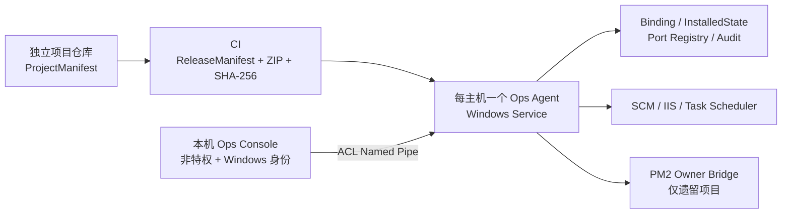

# CompanyOps Windows 统一运维平台

这是一个面向“同一台 Windows 主机运行多个独立项目”的声明式运维控制平面。每台主机只运行一个高权限 `Ops Agent`，项目提交标准化运维声明；本机 `Ops Console` 通过受 ACL 保护的 Named Pipe 查询或申请操作，不直接持有管理员权限，也不提供任意 shell。

## 已实现的 MVP

- 五类 v1 契约：`ProjectManifest`、`ReleaseManifest`、`EnvironmentBinding`、`InstalledState`、`PortRegistry`；
- .NET 10 Windows Agent：SCM、IIS、Task Scheduler、监听端口和遗留 PM2 只读盘点；
- 项目/环境/组件聚合：声明、绑定、InstalledState 和主机资源精确关联，跨项目原生资源重复声明失败关闭；
- 安全控制：generation 乐观锁、幂等键、资源门禁、依赖拓扑、HTTP/TCP/文件心跳健康门禁和完整审计；
- 白名单适配器：Windows SCM、IIS site、Task Scheduler、PM2 owner bridge；
- 发布事务：目标架构/Agent 版本/ProjectManifest 哈希、制品大小/SHA-256、ZIP 路径防护、端口事务、不可变 release；已存在 Windows Service 支持真实 `ImagePath` 切换、依赖启动、健康复核和失败恢复；
- ASP.NET Core + Vue 3 Console：仅监听 loopback，Windows Negotiate，reader/operator/admin，防 CSRF、安全响应头和高风险确认；
- 诊断 CLI：查询与结构化 `operate` / `deploy` 请求。

`Ops:EnableMutations` 默认为 `false`。仓库测试不会注册、启动、停止或修改本机现有服务、IIS、任务计划或真实 PM2 daemon。

## 架构



项目不主动注册高权限资源，也不各自携带运维管理器。`ProjectManifest` 只表达需求；主机资源的最终名称、路径、端口和账号引用来自 `EnvironmentBinding`。

## 开发验证

```powershell
# 先在 PowerShell 中进入本仓库根目录，再执行：
dotnet restore .\OpsManifest.slnx --configfile .\NuGet.config
dotnet build .\OpsManifest.slnx -c Release --no-restore
dotnet test .\OpsManifest.slnx -c Release --no-build --no-restore
pwsh -NoProfile -File .\tests\Run-ContractTests.ps1

cd .\src\Ops.Console\ClientApp
npm ci --ignore-scripts
npm run build
```

校验项目声明：

```powershell
$ManifestPath = (Read-Host '请输入 Manifest 文件绝对路径').Trim()
pwsh -NoProfile -File .\tools\Test-OpsManifest.ps1 $ManifestPath

$ManifestDirectory = (Read-Host '请输入 Manifest 目录绝对路径').Trim()
pwsh -NoProfile -File .\tools\Test-OpsManifest.ps1 $ManifestDirectory -Recurse
```

生成可部署但尚未安装的发布目录：

```powershell
pwsh -NoProfile -File .\tools\Publish-OpsPlatform.ps1
```

## 使用入口

- [傻瓜式完整操作手册（从构建、安装到项目接入）](docs/complete-operations-manual.md)
- [v1 运维声明规范](docs/specification-v1.md)
- [系统架构与信任边界](docs/architecture.md)
- [MVP 运维手册](docs/mvp-operations.md)
- [PM2 Owner Bridge](docs/pm2-owner-bridge.md)
- [开发路线与验收边界](docs/roadmap.md)

## 明确边界

- MVP 不做多主机调度、容器编排、远程 shell、任意插件、Agent 自动升级或明文 Secret 管理；
- PM2 只用于迁移存量项目，新组件默认采用 Windows Service、IIS 或 Task Scheduler；
- 自动化通过不等于真实项目 UAT。安装 Windows Service、启用 mutations、配置真实 PM2 owner bridge、业务健康探针和发布回滚演练都需要单独现场授权。
