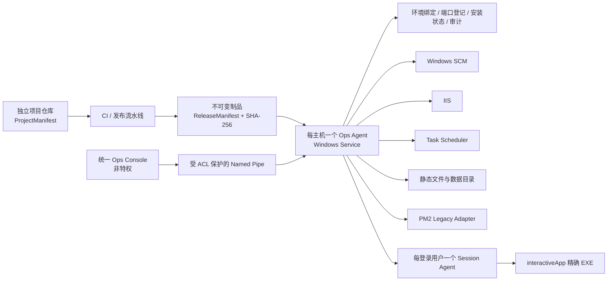
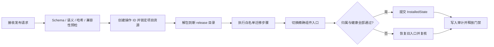

# Windows 统一运维平台架构

## 1. 决策

每台 Windows 主机部署一个高权限 Ops Agent，所有项目共用一个统一 Ops Console。独立项目不运行自己的运维管理器，也不允许业务进程主动向主机注册高权限资源。

项目仓库提交 `ProjectManifest`；CI 生成带哈希的 `ReleaseManifest`；授权运维者为具体主机维护 `EnvironmentBinding`；部署者或 Console 提交发布请求；Agent 校验发布包并生成 `InstalledState`。当前 MVP 不自动生成 EnvironmentBinding。

## 2. 信任边界

- Console 不直接持有管理员权限，也不执行 shell。
- Agent 以 Windows Service 运行，通过受 ACL 保护的 Named Pipe 接收结构化请求。
- Agent 只实现白名单资源适配器，不接受任意 PowerShell、CMD 或可执行文件命令。
- ProjectManifest 只表达需求；主机资源的最终值只能来自 EnvironmentBinding。
- EnvironmentBinding 的安装目录必须是 Agent 配置中受审父目录的严格子目录；未配置白名单、指向盘符根目录，或不同项目目录相同、互相嵌套时失败关闭。
- ReleaseManifest 的制品必须按大小和 SHA-256 验证，版本安装采用临时目录、预检、原子切换和失败回滚；核心代码不得包含项目 ID、服务名或 EXE 名分支。
- Secret 只以引用形式出现，实际值由未来的 Secret Provider 在执行时解析，永不写入日志或 InstalledState。

## 3. Agent 模块

| 模块 | 职责 |
|---|---|
| Manifest Catalog | 发现、解析、版本协商和验证五类契约 |
| Deployment Engine | 预检、解包、迁移、切换、健康复核和回滚 |
| Environment Manager | 安装目录、数据目录、服务账户、ACL 和配置绑定 |
| Port Registry | 主机级端口占用发现、预留、确认和释放 |
| Service Controller | 通过 SCM、IIS、任务计划和遗留 PM2 适配器精确控制 |
| Health & Logs | 进程归属、HTTP/TCP/文件心跳、结构化日志和过期状态处理 |
| State & Audit | SQLite 安装状态、操作 ID、操作者、前后版本和结果 |
| Backup Adapter | 声明式备份资源与恢复验证，不允许项目传入任意备份脚本 |

## 4. 组件类型

v1 首先定义以下有限类型：

- `windowsService`：后台 API、Worker 或常驻进程，最终由 Windows SCM 承载。
- `iisSite`：ASP.NET 或需要 IIS 应用池的站点。
- `staticSite`：Vue/React 等已构建静态产物，由 IIS 静态站点承载。
- `scheduledTask`：周期任务或按事件触发的一次性任务。
- `pm2Legacy`：迁移期兼容既有 PM2 服务，不允许新项目默认选择。
- `interactiveApp`：需要窗口、托盘、摄像头、浏览器或用户交互的程序。由每个登录用户一个 `CompanyOps.SessionAgent` 在用户 Session 中承载，禁止作为 Windows Service 跨 Session 0 显示界面。

v1 Schema 只声明公共安全面；每种适配器更详细的安装参数将在其能力模型定稿后追加，避免过早开放任意命令字段。

## 5. 更新事务

更新不得直接覆盖正在运行的目录。每个项目至少保留当前版本和上一可回滚版本；数据库迁移必须声明回滚兼容性，不能把文件回滚错误地等同于数据库回滚。

`windowsService` 与 `interactiveApp` 共用同一组件事务：按反向依赖精确停止，切换 ReleaseManifest 声明的入口，再按依赖顺序启动并运行全部探针。原生 SCM 服务切换 `ImagePath`；NSSM 服务保持 SCM 指向 `nssm.exe`，只切换受控的 `Application/AppDirectory/AppParameters`；交互程序由 Agent 原子写入当前入口状态，Agent 与 Session Agent 使用同一状态。任一步受控失败均恢复每个组件的旧入口和原运行状态。

## 6. 遗留 PM2 边界

PM2 适配器只用于现存项目迁移：每次操作重新获取快照，按精确名称、规范化 cwd 和精确脚本验证唯一归属，再仅按 `pm_id` 控制。任何冲突都失败关闭；禁止设置 `PM2_HOME`，禁止 `stop all`、`delete all` 和 `kill`。
